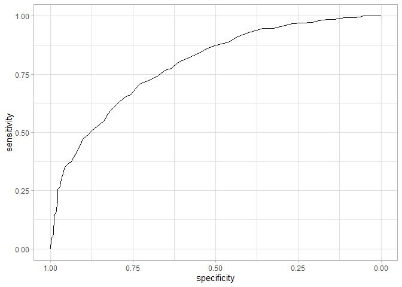

```r
library(tidyverse)
library(pROC)
library(gtsummary)
library(ggplot2)
```


# Прочитаем данные и посмотрим на общую информацию по ним


```r
diabetes <- read.csv("diabetes.csv")

summary(diabetes)
```

```
##   Pregnancies        Glucose      BloodPressure    SkinThickness  
##  Min.   : 0.000   Min.   :  0.0   Min.   :  0.00   Min.   : 0.00  
##  1st Qu.: 1.000   1st Qu.: 99.0   1st Qu.: 62.00   1st Qu.: 0.00  
##  Median : 3.000   Median :117.0   Median : 72.00   Median :23.00  
##  Mean   : 3.845   Mean   :120.9   Mean   : 69.11   Mean   :20.54  
##  3rd Qu.: 6.000   3rd Qu.:140.2   3rd Qu.: 80.00   3rd Qu.:32.00  
##  Max.   :17.000   Max.   :199.0   Max.   :122.00   Max.   :99.00  
##     Insulin           BMI        DiabetesPedigreeFunction      Age       
##  Min.   :  0.0   Min.   : 0.00   Min.   :0.0780           Min.   :21.00  
##  1st Qu.:  0.0   1st Qu.:27.30   1st Qu.:0.2437           1st Qu.:24.00  
##  Median : 30.5   Median :32.00   Median :0.3725           Median :29.00  
##  Mean   : 79.8   Mean   :31.99   Mean   :0.4719           Mean   :33.24  
##  3rd Qu.:127.2   3rd Qu.:36.60   3rd Qu.:0.6262           3rd Qu.:41.00  
##  Max.   :846.0   Max.   :67.10   Max.   :2.4200           Max.   :81.00  
##     Outcome     
##  Min.   :0.000  
##  1st Qu.:0.000  
##  Median :0.000  
##  Mean   :0.349  
##  3rd Qu.:1.000  
##  Max.   :1.000
```

```r
str(diabetes)
```

```
## 'data.frame':	768 obs. of  9 variables:
##  $ Pregnancies             : int  6 1 8 1 0 5 3 10 2 8 ...
##  $ Glucose                 : int  148 85 183 89 137 116 78 115 197 125 ...
##  $ BloodPressure           : int  72 66 64 66 40 74 50 0 70 96 ...
##  $ SkinThickness           : int  35 29 0 23 35 0 32 0 45 0 ...
##  $ Insulin                 : int  0 0 0 94 168 0 88 0 543 0 ...
##  $ BMI                     : num  33.6 26.6 23.3 28.1 43.1 25.6 31 35.3 30.5 0 ...
##  $ DiabetesPedigreeFunction: num  0.627 0.351 0.672 0.167 2.288 ...
##  $ Age                     : int  50 31 32 21 33 30 26 29 53 54 ...
##  $ Outcome                 : int  1 0 1 0 1 0 1 0 1 1 ...
```

# Поработаем с количественными переменными

Заменим все нулевые значения в колонках Glucose, BloodPressure, SkinThickness, Insulin и BMI на NA как малосовместимые с жизнью.
Помимо этого, переведем значения глюкозы в более привычную для нас размерность ммоль/л.


```r
diabetes <- diabetes %>%
  mutate(across(c(Glucose, BloodPressure, SkinThickness, Insulin, BMI), ~ ifelse(.x == 0, NA, .x)),
         Glucose_mmol = round(Glucose / 18, 1),
         Glucose_mmol = as.numeric(Glucose_mmol),
         Outcome = ifelse(Outcome == 1, "Yes", "No"))

glimpse(diabetes)
```

```
## Rows: 768
## Columns: 10
## $ Pregnancies              <int> 6, 1, 8, 1, 0, 5, 3, 10, 2, 8, 4, 10, 10, 1, …
## $ Glucose                  <int> 148, 85, 183, 89, 137, 116, 78, 115, 197, 125…
## $ BloodPressure            <int> 72, 66, 64, 66, 40, 74, 50, NA, 70, 96, 92, 7…
## $ SkinThickness            <int> 35, 29, NA, 23, 35, NA, 32, NA, 45, NA, NA, N…
## $ Insulin                  <int> NA, NA, NA, 94, 168, NA, 88, NA, 543, NA, NA,…
## $ BMI                      <dbl> 33.6, 26.6, 23.3, 28.1, 43.1, 25.6, 31.0, 35.…
## $ DiabetesPedigreeFunction <dbl> 0.627, 0.351, 0.672, 0.167, 2.288, 0.201, 0.2…
## $ Age                      <int> 50, 31, 32, 21, 33, 30, 26, 29, 53, 54, 30, 3…
## $ Outcome                  <chr> "Yes", "No", "Yes", "No", "Yes", "No", "Yes",…
## $ Glucose_mmol             <dbl> 8.2, 4.7, 10.2, 4.9, 7.6, 6.4, 4.3, 6.4, 10.9…
```


# Вопрос №1

*Количество пациентов, которым можно выставить диагноз сахарный диабет?*

<br>

*Количество пациентов без нарушения толерантности к глюкозе?*

<br>


```r
# Создадим вектор всех значений глюкозы в ммоль/л, за исключением пропущенных значений

diabetes_no_nas <- diabetes[complete.cases(diabetes$Glucose_mmol), ]$Glucose_mmol

# И посчитаем количество элементов, удовлетворяющих условиям

patients_with_diabetes <- length(diabetes_no_nas[diabetes_no_nas >= 7.8])
patients_with_diabetes
```

```
## [1] 197
```

```r
patients_without_diabetes <- length(diabetes_no_nas[diabetes_no_nas < 7.8])
patients_without_diabetes
```

```
## [1] 566
```

Таким образом, если использовать в качестве порогового критерия уровень глюкозы >= 7.8 ммоль/л, то сахарный диабет можно установить у **197** пациентов.
У **566** пациентов нарушения толерантности к глюкозе нет.

<br>

Посмотрим на сравнительную статистику групп с и без диабета


```r
diabetes%>% 
    tbl_summary(by = Outcome) %>% 
    add_p()
```

```{=html}
<div id="fbqzspeyph" style="overflow-x:auto;overflow-y:auto;width:auto;height:auto;">
<style>html {
  font-family: -apple-system, BlinkMacSystemFont, 'Segoe UI', Roboto, Oxygen, Ubuntu, Cantarell, 'Helvetica Neue', 'Fira Sans', 'Droid Sans', Arial, sans-serif;
}

#fbqzspeyph .gt_table {
  display: table;
  border-collapse: collapse;
  margin-left: auto;
  margin-right: auto;
  color: #333333;
  font-size: 16px;
  font-weight: normal;
  font-style: normal;
  background-color: #FFFFFF;
  width: auto;
  border-top-style: solid;
  border-top-width: 2px;
  border-top-color: #A8A8A8;
  border-right-style: none;
  border-right-width: 2px;
  border-right-color: #D3D3D3;
  border-bottom-style: solid;
  border-bottom-width: 2px;
  border-bottom-color: #A8A8A8;
  border-left-style: none;
  border-left-width: 2px;
  border-left-color: #D3D3D3;
}

#fbqzspeyph .gt_heading {
  background-color: #FFFFFF;
  text-align: center;
  border-bottom-color: #FFFFFF;
  border-left-style: none;
  border-left-width: 1px;
  border-left-color: #D3D3D3;
  border-right-style: none;
  border-right-width: 1px;
  border-right-color: #D3D3D3;
}

#fbqzspeyph .gt_title {
  color: #333333;
  font-size: 125%;
  font-weight: initial;
  padding-top: 4px;
  padding-bottom: 4px;
  padding-left: 5px;
  padding-right: 5px;
  border-bottom-color: #FFFFFF;
  border-bottom-width: 0;
}

#fbqzspeyph .gt_subtitle {
  color: #333333;
  font-size: 85%;
  font-weight: initial;
  padding-top: 0;
  padding-bottom: 6px;
  padding-left: 5px;
  padding-right: 5px;
  border-top-color: #FFFFFF;
  border-top-width: 0;
}

#fbqzspeyph .gt_bottom_border {
  border-bottom-style: solid;
  border-bottom-width: 2px;
  border-bottom-color: #D3D3D3;
}

#fbqzspeyph .gt_col_headings {
  border-top-style: solid;
  border-top-width: 2px;
  border-top-color: #D3D3D3;
  border-bottom-style: solid;
  border-bottom-width: 2px;
  border-bottom-color: #D3D3D3;
  border-left-style: none;
  border-left-width: 1px;
  border-left-color: #D3D3D3;
  border-right-style: none;
  border-right-width: 1px;
  border-right-color: #D3D3D3;
}

#fbqzspeyph .gt_col_heading {
  color: #333333;
  background-color: #FFFFFF;
  font-size: 100%;
  font-weight: normal;
  text-transform: inherit;
  border-left-style: none;
  border-left-width: 1px;
  border-left-color: #D3D3D3;
  border-right-style: none;
  border-right-width: 1px;
  border-right-color: #D3D3D3;
  vertical-align: bottom;
  padding-top: 5px;
  padding-bottom: 6px;
  padding-left: 5px;
  padding-right: 5px;
  overflow-x: hidden;
}

#fbqzspeyph .gt_column_spanner_outer {
  color: #333333;
  background-color: #FFFFFF;
  font-size: 100%;
  font-weight: normal;
  text-transform: inherit;
  padding-top: 0;
  padding-bottom: 0;
  padding-left: 4px;
  padding-right: 4px;
}

#fbqzspeyph .gt_column_spanner_outer:first-child {
  padding-left: 0;
}

#fbqzspeyph .gt_column_spanner_outer:last-child {
  padding-right: 0;
}

#fbqzspeyph .gt_column_spanner {
  border-bottom-style: solid;
  border-bottom-width: 2px;
  border-bottom-color: #D3D3D3;
  vertical-align: bottom;
  padding-top: 5px;
  padding-bottom: 5px;
  overflow-x: hidden;
  display: inline-block;
  width: 100%;
}

#fbqzspeyph .gt_group_heading {
  padding-top: 8px;
  padding-bottom: 8px;
  padding-left: 5px;
  padding-right: 5px;
  color: #333333;
  background-color: #FFFFFF;
  font-size: 100%;
  font-weight: initial;
  text-transform: inherit;
  border-top-style: solid;
  border-top-width: 2px;
  border-top-color: #D3D3D3;
  border-bottom-style: solid;
  border-bottom-width: 2px;
  border-bottom-color: #D3D3D3;
  border-left-style: none;
  border-left-width: 1px;
  border-left-color: #D3D3D3;
  border-right-style: none;
  border-right-width: 1px;
  border-right-color: #D3D3D3;
  vertical-align: middle;
}

#fbqzspeyph .gt_empty_group_heading {
  padding: 0.5px;
  color: #333333;
  background-color: #FFFFFF;
  font-size: 100%;
  font-weight: initial;
  border-top-style: solid;
  border-top-width: 2px;
  border-top-color: #D3D3D3;
  border-bottom-style: solid;
  border-bottom-width: 2px;
  border-bottom-color: #D3D3D3;
  vertical-align: middle;
}

#fbqzspeyph .gt_from_md > :first-child {
  margin-top: 0;
}

#fbqzspeyph .gt_from_md > :last-child {
  margin-bottom: 0;
}

#fbqzspeyph .gt_row {
  padding-top: 8px;
  padding-bottom: 8px;
  padding-left: 5px;
  padding-right: 5px;
  margin: 10px;
  border-top-style: solid;
  border-top-width: 1px;
  border-top-color: #D3D3D3;
  border-left-style: none;
  border-left-width: 1px;
  border-left-color: #D3D3D3;
  border-right-style: none;
  border-right-width: 1px;
  border-right-color: #D3D3D3;
  vertical-align: middle;
  overflow-x: hidden;
}

#fbqzspeyph .gt_stub {
  color: #333333;
  background-color: #FFFFFF;
  font-size: 100%;
  font-weight: initial;
  text-transform: inherit;
  border-right-style: solid;
  border-right-width: 2px;
  border-right-color: #D3D3D3;
  padding-left: 5px;
  padding-right: 5px;
}

#fbqzspeyph .gt_stub_row_group {
  color: #333333;
  background-color: #FFFFFF;
  font-size: 100%;
  font-weight: initial;
  text-transform: inherit;
  border-right-style: solid;
  border-right-width: 2px;
  border-right-color: #D3D3D3;
  padding-left: 5px;
  padding-right: 5px;
  vertical-align: top;
}

#fbqzspeyph .gt_row_group_first td {
  border-top-width: 2px;
}

#fbqzspeyph .gt_summary_row {
  color: #333333;
  background-color: #FFFFFF;
  text-transform: inherit;
  padding-top: 8px;
  padding-bottom: 8px;
  padding-left: 5px;
  padding-right: 5px;
}

#fbqzspeyph .gt_first_summary_row {
  border-top-style: solid;
  border-top-color: #D3D3D3;
}

#fbqzspeyph .gt_first_summary_row.thick {
  border-top-width: 2px;
}

#fbqzspeyph .gt_last_summary_row {
  padding-top: 8px;
  padding-bottom: 8px;
  padding-left: 5px;
  padding-right: 5px;
  border-bottom-style: solid;
  border-bottom-width: 2px;
  border-bottom-color: #D3D3D3;
}

#fbqzspeyph .gt_grand_summary_row {
  color: #333333;
  background-color: #FFFFFF;
  text-transform: inherit;
  padding-top: 8px;
  padding-bottom: 8px;
  padding-left: 5px;
  padding-right: 5px;
}

#fbqzspeyph .gt_first_grand_summary_row {
  padding-top: 8px;
  padding-bottom: 8px;
  padding-left: 5px;
  padding-right: 5px;
  border-top-style: double;
  border-top-width: 6px;
  border-top-color: #D3D3D3;
}

#fbqzspeyph .gt_striped {
  background-color: rgba(128, 128, 128, 0.05);
}

#fbqzspeyph .gt_table_body {
  border-top-style: solid;
  border-top-width: 2px;
  border-top-color: #D3D3D3;
  border-bottom-style: solid;
  border-bottom-width: 2px;
  border-bottom-color: #D3D3D3;
}

#fbqzspeyph .gt_footnotes {
  color: #333333;
  background-color: #FFFFFF;
  border-bottom-style: none;
  border-bottom-width: 2px;
  border-bottom-color: #D3D3D3;
  border-left-style: none;
  border-left-width: 2px;
  border-left-color: #D3D3D3;
  border-right-style: none;
  border-right-width: 2px;
  border-right-color: #D3D3D3;
}

#fbqzspeyph .gt_footnote {
  margin: 0px;
  font-size: 90%;
  padding-left: 4px;
  padding-right: 4px;
  padding-left: 5px;
  padding-right: 5px;
}

#fbqzspeyph .gt_sourcenotes {
  color: #333333;
  background-color: #FFFFFF;
  border-bottom-style: none;
  border-bottom-width: 2px;
  border-bottom-color: #D3D3D3;
  border-left-style: none;
  border-left-width: 2px;
  border-left-color: #D3D3D3;
  border-right-style: none;
  border-right-width: 2px;
  border-right-color: #D3D3D3;
}

#fbqzspeyph .gt_sourcenote {
  font-size: 90%;
  padding-top: 4px;
  padding-bottom: 4px;
  padding-left: 5px;
  padding-right: 5px;
}

#fbqzspeyph .gt_left {
  text-align: left;
}

#fbqzspeyph .gt_center {
  text-align: center;
}

#fbqzspeyph .gt_right {
  text-align: right;
  font-variant-numeric: tabular-nums;
}

#fbqzspeyph .gt_font_normal {
  font-weight: normal;
}

#fbqzspeyph .gt_font_bold {
  font-weight: bold;
}

#fbqzspeyph .gt_font_italic {
  font-style: italic;
}

#fbqzspeyph .gt_super {
  font-size: 65%;
}

#fbqzspeyph .gt_footnote_marks {
  font-style: italic;
  font-weight: normal;
  font-size: 75%;
  vertical-align: 0.4em;
}

#fbqzspeyph .gt_asterisk {
  font-size: 100%;
  vertical-align: 0;
}

#fbqzspeyph .gt_indent_1 {
  text-indent: 5px;
}

#fbqzspeyph .gt_indent_2 {
  text-indent: 10px;
}

#fbqzspeyph .gt_indent_3 {
  text-indent: 15px;
}

#fbqzspeyph .gt_indent_4 {
  text-indent: 20px;
}

#fbqzspeyph .gt_indent_5 {
  text-indent: 25px;
}
</style>
<table class="gt_table">
  
  <thead class="gt_col_headings">
    <tr>
      <th class="gt_col_heading gt_columns_bottom_border gt_left" rowspan="1" colspan="1" scope="col"><strong>Characteristic</strong></th>
      <th class="gt_col_heading gt_columns_bottom_border gt_center" rowspan="1" colspan="1" scope="col"><strong>No</strong>, N = 500<sup class="gt_footnote_marks">1</sup></th>
      <th class="gt_col_heading gt_columns_bottom_border gt_center" rowspan="1" colspan="1" scope="col"><strong>Yes</strong>, N = 268<sup class="gt_footnote_marks">1</sup></th>
      <th class="gt_col_heading gt_columns_bottom_border gt_center" rowspan="1" colspan="1" scope="col"><strong>p-value</strong><sup class="gt_footnote_marks">2</sup></th>
    </tr>
  </thead>
  <tbody class="gt_table_body">
    <tr><td class="gt_row gt_left">Pregnancies</td>
<td class="gt_row gt_center">2 (1, 5)</td>
<td class="gt_row gt_center">4 (2, 8)</td>
<td class="gt_row gt_center"><0.001</td></tr>
    <tr><td class="gt_row gt_left">Glucose</td>
<td class="gt_row gt_center">107 (93, 125)</td>
<td class="gt_row gt_center">140 (119, 167)</td>
<td class="gt_row gt_center"><0.001</td></tr>
    <tr><td class="gt_row gt_left">    Unknown</td>
<td class="gt_row gt_center">3</td>
<td class="gt_row gt_center">2</td>
<td class="gt_row gt_center"></td></tr>
    <tr><td class="gt_row gt_left">BloodPressure</td>
<td class="gt_row gt_center">70 (62, 78)</td>
<td class="gt_row gt_center">74 (68, 84)</td>
<td class="gt_row gt_center"><0.001</td></tr>
    <tr><td class="gt_row gt_left">    Unknown</td>
<td class="gt_row gt_center">19</td>
<td class="gt_row gt_center">16</td>
<td class="gt_row gt_center"></td></tr>
    <tr><td class="gt_row gt_left">SkinThickness</td>
<td class="gt_row gt_center">27 (19, 33)</td>
<td class="gt_row gt_center">32 (27, 39)</td>
<td class="gt_row gt_center"><0.001</td></tr>
    <tr><td class="gt_row gt_left">    Unknown</td>
<td class="gt_row gt_center">139</td>
<td class="gt_row gt_center">88</td>
<td class="gt_row gt_center"></td></tr>
    <tr><td class="gt_row gt_left">Insulin</td>
<td class="gt_row gt_center">102 (66, 161)</td>
<td class="gt_row gt_center">170 (128, 239)</td>
<td class="gt_row gt_center"><0.001</td></tr>
    <tr><td class="gt_row gt_left">    Unknown</td>
<td class="gt_row gt_center">236</td>
<td class="gt_row gt_center">138</td>
<td class="gt_row gt_center"></td></tr>
    <tr><td class="gt_row gt_left">BMI</td>
<td class="gt_row gt_center">30 (26, 35)</td>
<td class="gt_row gt_center">34 (31, 39)</td>
<td class="gt_row gt_center"><0.001</td></tr>
    <tr><td class="gt_row gt_left">    Unknown</td>
<td class="gt_row gt_center">9</td>
<td class="gt_row gt_center">2</td>
<td class="gt_row gt_center"></td></tr>
    <tr><td class="gt_row gt_left">DiabetesPedigreeFunction</td>
<td class="gt_row gt_center">0.34 (0.23, 0.56)</td>
<td class="gt_row gt_center">0.45 (0.26, 0.73)</td>
<td class="gt_row gt_center"><0.001</td></tr>
    <tr><td class="gt_row gt_left">Age</td>
<td class="gt_row gt_center">27 (23, 37)</td>
<td class="gt_row gt_center">36 (28, 44)</td>
<td class="gt_row gt_center"><0.001</td></tr>
    <tr><td class="gt_row gt_left">Glucose_mmol</td>
<td class="gt_row gt_center">5.90 (5.20, 6.90)</td>
<td class="gt_row gt_center">7.80 (6.60, 9.30)</td>
<td class="gt_row gt_center"><0.001</td></tr>
    <tr><td class="gt_row gt_left">    Unknown</td>
<td class="gt_row gt_center">3</td>
<td class="gt_row gt_center">2</td>
<td class="gt_row gt_center"></td></tr>
  </tbody>
  
  <tfoot class="gt_footnotes">
    <tr>
      <td class="gt_footnote" colspan="4"><sup class="gt_footnote_marks">1</sup> Median (IQR)</td>
    </tr>
    <tr>
      <td class="gt_footnote" colspan="4"><sup class="gt_footnote_marks">2</sup> Wilcoxon rank sum test</td>
    </tr>
  </tfoot>
</table>
</div>
```


# Вопрос №2

*ROC-кривая для предсказания сахарного диабета по уровню гликемии*


```r
diabetes$Outcome = as.factor(diabetes$Outcome)

roc_curve <- roc(Outcome ~ Glucose_mmol, data = diabetes, ci = T)
```

```
## Setting levels: control = No, case = Yes
```

```
## Setting direction: controls < cases
```

```r
roc_curve
```

```
## 
## Call:
## roc.formula(formula = Outcome ~ Glucose_mmol, data = diabetes,     ci = T)
## 
## Data: Glucose_mmol in 497 controls (Outcome No) < 266 cases (Outcome Yes).
## Area under the curve: 0.7932
## 95% CI: 0.7603-0.826 (DeLong)
```

```r
ggroc(roc_curve) +
  theme_light()
```

<!-- -->

# Вопрос №3

*Чему равна площадь под ROC-кривой?*


```r
roc_curve$auc
```

```
## Area under the curve: 0.7932
```

# Вопрос №4

*Чему равен 95% двусторонний доверительный интервал?*


```r
roc_curve$ci
```

```
## 95% CI: 0.7603-0.826 (DeLong)
```

